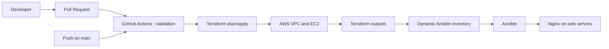

# AWS Terraform + Ansible + Nginx

Projet DevOps de provisionnement d'une infrastructure AWS et de deploiement
automatise de Nginx avec Terraform, Ansible et GitHub Actions.

## Objectifs

- Declarer l'infrastructure AWS as code avec Terraform.
- Deployer Nginx de maniere reproductible avec Ansible.
- Valider les changements automatiquement avec GitHub Actions.
- Deployer uniquement depuis `main` apres validation.
- Permettre une destruction manuelle et explicitement confirmee.

## Architecture



Terraform creates a public VPC network, one public subnet, internet routing,
a security group and five Ubuntu 22.04 EC2 instances named `web-01` through
`web-05`. Ansible connects to their public IP addresses and installs Nginx.

## Repository layout

```text
terraform/
  main.tf          AWS network, security group and EC2 instances
  providers.tf     Provider, backend and Terraform version
  variables.tf     Configurable Terraform inputs
  output.tf        Outputs consumed by the pipeline

ansible/
  ansible.cfg      Local Ansible defaults
  inventory/       Static local inventory
  playbooks/
    nginx.yml      Nginx installation and service configuration

.github/workflows/
  ci-cd.yml        Validation, deployment and manual destruction
```

## CI/CD workflow

### Validation

Pull requests run without modifying AWS and execute:

- `terraform fmt -check`
- `terraform init -backend=false`
- `terraform validate`
- Ansible syntax check
- `ansible-lint`
- `yamllint`

### Deployment

A push to `main` runs the protected `production` deployment:

1. Authenticate to AWS through GitHub OIDC.
2. Detect the public IP of the GitHub runner.
3. Restrict SSH ingress to that IP as a `/32` rule.
4. Run `terraform plan` and `terraform apply`.
5. Read the `web_servers` Terraform output.
6. Generate a temporary Ansible inventory.
7. Validate the SSH private key.
8. Install and start Nginx on every web server.

### Manual destruction

From **Actions**, run the workflow manually with:

- `action`: `destroy`
- `confirm_destroy`: `DESTROY`

The destroy job creates a `terraform plan -destroy` plan and applies that plan.
It does not run during a deployment execution.

## GitHub configuration

Create an environment named `production` with the following values:

### Secrets

| Name | Purpose |
| --- | --- |
| `AWS_ROLE_ARN` | IAM role assumed through GitHub OIDC |
| `ANSIBLE_SSH_PRIVATE_KEY` | Unencrypted OpenSSH private key for the EC2 key pair |

### Variables

| Name | Purpose |
| --- | --- |
| `TF_KEY_NAME` | Existing AWS EC2 key pair name |
| `TF_ALLOWED_SSH_CIDR` | SSH CIDR used by manual/local Terraform runs |

The deployment job computes the GitHub runner CIDR dynamically, so the fixed
`TF_ALLOWED_SSH_CIDR` value is not used for CI deployment.

The AWS role must trust the GitHub OIDC provider and be restricted to this
repository and the `production` environment. Its permissions should be scoped
to the Terraform resources instead of using `AdministratorAccess` in a real
production account.

## Local usage

```bash
cd terraform
terraform init
terraform plan
terraform apply

cd ../ansible
ansible-playbook --syntax-check playbooks/nginx.yml
ansible-playbook -i inventory/hosts.yml playbooks/nginx.yml
```

The S3 backend must already exist and its bucket should have encryption,
versioning and restricted access enabled.

## Security notes

- SSH access is restricted to the active CI runner during deployment.
- AWS credentials are not stored in GitHub; OIDC is used instead.
- The SSH key is stored as a GitHub environment secret and validated before use.
- The current lab uses public EC2 instances. A production architecture should
  prefer private subnets and AWS Systems Manager or a controlled bastion host.
- Replace broad IAM permissions with a least-privilege deployment role.
