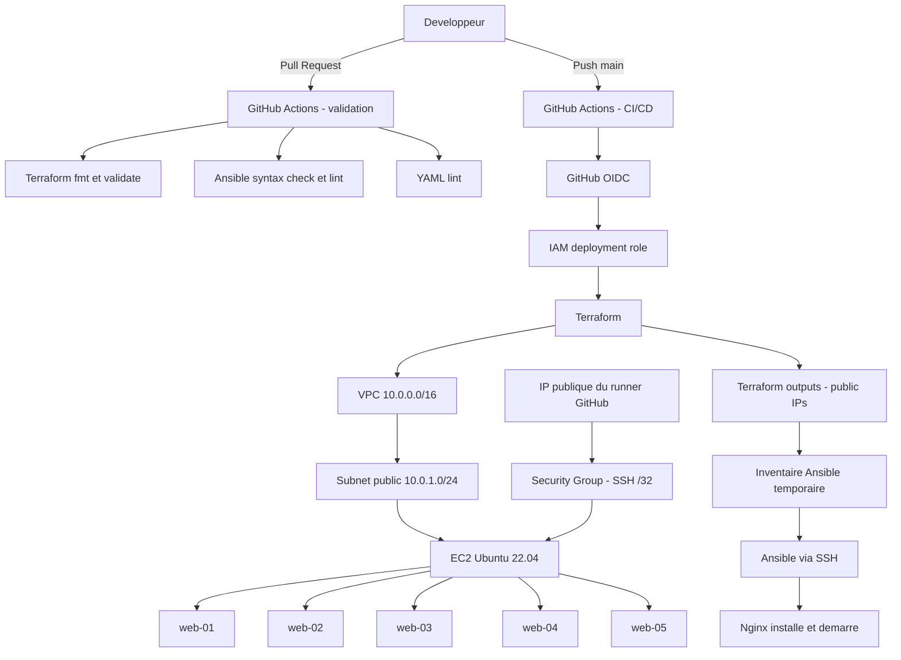
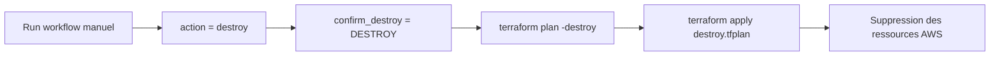

# Architecture de deploiement

Ce document presente le flux entre le developpeur, GitHub Actions, AWS,
Terraform et Ansible.

## Vue globale

## Flux de deploiement

1. Une pull request execute uniquement les validations.
2. Un push vers `main` declenche le job de deploiement apres validation.
3. GitHub Actions assume le role IAM AWS via OIDC.
4. Terraform met a jour l'infrastructure et le Security Group.
5. L'IP publique du runner est autorisee temporairement pour SSH.
6. Les IPs publiques Terraform generent l'inventaire Ansible.
7. Ansible se connecte aux instances EC2 et configure Nginx.

## Flux de destruction

La destruction utilise le meme backend Terraform S3 et l'environnement GitHub
`production`. Elle exige une confirmation explicite afin d'eviter une
suppression accidentelle.

## Flux reseau

- SSH : runner GitHub vers EC2 sur le port `22`, limite a l'IP du runner en
  `/32`.
- HTTP : utilisateurs vers les EC2 sur le port `80`.
- Sorties EC2 : autorisees vers Internet pour l'installation des paquets.
- Etat Terraform : stocke dans le backend S3 avec verrouillage.
